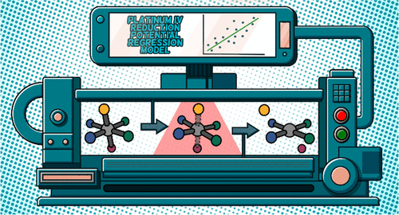

# Machine Learning-Based Prediction of Reduction Potentials for Pt<sup>IV</sup> Complexes

<p align="center">
  
</p>

# Machine Learning for Platinum(IV) Complex Reduction Potential Prediction

[](https://www.python.org/downloads/)
[](https://scikit-learn.org/)
[](LICENSE)
[](https://doi.org/10.1021/acs.jcim.4c00315)

> **Published Research**: *Journal of Chemical Information and Modeling* (2024)  
> **Achievement**: 92% R² accuracy in predicting electrochemical properties of platinum-based anticancer drug candidates



## 🎯 Project Impact

This project demonstrates the successful application of **machine learning to accelerate pharmaceutical research**, specifically in designing platinum-based anticancer prodrugs. By predicting reduction potentials computationally, we eliminated the need for costly experimental testing while maintaining high accuracy.

**Key Results:**
- **MSE**: 0.016 V²
- **RMSE**: 0.13 V
- **R²**: 0.92
- **Feature reduction**: From 5514 to just 20 optimized descriptors

## 🔬 Problem Statement

Platinum(IV) complexes are promising anticancer prodrug candidates, but their effectiveness depends critically on their reduction potential. Traditional experimental methods are:
- Time-consuming
- Expensive
- Limited in throughput

**Solution**: Build an ML pipeline that predicts reduction potentials from molecular structure, enabling rapid screening of thousands of candidates.

## 🛠️ Technical Informations

### Machine Learning & Data Science
- **Algorithm comparison**: Evaluated 5 regression models (Random Forest, Gradient Boosting, XGBoost, Extra Trees, Decision Trees)
- **Feature engineering**: Reduced 5514 initial features to 20 critical descriptors using correlation analysis and recursive feature elimination
- **Cross-validation**: Implemented Leave-One-Out CV for reliable performance estimation on small datasets
- **Hyperparameter optimization**: Random Grid Search with 6000 iterations
- **Outlier detection**: Statistical methods for data quality improvement

### Computational Chemistry Integration
- **Molecular descriptors**: Generated Extended Circular Fingerprints (ECFP) from SMILES strings
- **Quantum chemistry**: Extracted LUMO energies from DFT calculations (Gaussian16)
- **Chemical informatics**: Used RDKit, Alvadesc, and OpenBabel for molecular representation

### Software Engineering Best Practices
- **Modular design**: Clean, reusable functions for data processing and model evaluation
- **Version control**: Well-documented GitHub repository
- **Reproducibility**: Random seeds and explicit hyperparameters
- **Visualization**: Publication-quality plots for model interpretation

## 📊 Methodology Highlights

### Data Pipeline
```
Literature Data (132 complexes)
    ↓
SMILES Generation & Validation
    ↓
Molecular Descriptor Calculation
    ├── ECFP (2048-bit fingerprints)
    ├── 2D Atom Pairs (Alvadesc)
    └── LUMO energies (DFT)
    ↓
Feature Engineering
    ├── Dummy encoding
    ├── Correlation filtering (>0.9)
    └── Recursive Feature Elimination
    ↓
Model Training & Optimization
    ├── 5 model comparison
    ├── Hyperparameter tuning
    └── LOOCV validation
    ↓
Final Model: Extra Trees Regressor (20 features)
```

### Key Technical Decisions

1. **Extra Trees Regressor selected** over other ensemble methods for:
   - Comparable performance to more complex models
   - Fewer features required (interpretability)
   - Faster training time

2. **LOOCV chosen** for validation:
   - Small dataset (132 samples)
   - More stable than k-fold for limited data
   - Better generalization estimates

3. **Feature selection strategy**:
   - Statistical correlation analysis
   - Model-based importance ranking
   - Recursive elimination with performance monitoring

## 🔍 Scientific Insights

The model identified key structural factors affecting reduction potential:

- **F07[C-Cl]**: Long aliphatic chains with chloride ligands
- **NsCl_4**: Four chloride ligands directly bound to platinum
- **B02[O-O]**: Oxalate-like chelating ligands
- **LUMO energy**: Inverse relationship with reduction potential (Koopmans' theorem)

These findings provide actionable insights for rational drug design.

## 🚀 Installation & Usage

### Requirements
```bash
pip install -r requirements.txt
```

**Core dependencies:**
- pandas, numpy, scikit-learn
- RDKit (chemical informatics)
- xgboost
- matplotlib, seaborn

### Quick Start

```python
from PROMOCS import load_smiles, generate_ECFP, benchmark, evaluate_model

molecules = load_smiles('dataset/smiles.smi')
descriptors = generate_ECFP(molecules, radius=6, nbit=2048)

models = [RandomForestRegressor(), ExtraTreesRegressor(), GradientBoostingRegressor()]
results = benchmark(X, y, models)

best_model = ExtraTreesRegressor()
metrics, importance, predictions = evaluate_model(X, y, best_model)
```

### Module Structure
```
PROMOCS/
├── __init__.py          # Main module with all functions
├── load_smiles()        # Parse molecular structures
├── generate_ECFP()      # Calculate fingerprints
├── OHE()                # One-hot encoding
├── detect_high_corr()   # Feature correlation analysis
├── benchmark()          # Compare multiple models
├── select_features()    # Model-based feature selection
├── evaluate_model()     # LOOCV evaluation
├── RFE()                # Recursive feature elimination
└── Visualization tools  # plot_scatter(), plot2D(), corr_matrix()
```

## 📈 Results

### Model Performance Comparison

| Model | MSE (V²) | RMSE (V) | MAE (V) | R² | Features |
|-------|----------|----------|---------|-----|----------|
| Extra Trees | 0.016 | 0.126 | 0.106 | 0.92 | 20 |
| XGBoost | 0.029 | 0.17 | 0.109 | 0.86 | 87 |
| Gradient Boosting | 0.031 | 0.17 | 0.120 | 0.85 | 110 |
| Random Forest | 0.048 | 0.22 | 0.148 | 0.77 | 238 |

### Principal Component Analysis

PCA revealed clear separation of complexes by reduction potential along PC2, with key descriptors (F07[C-Cl], NsCl_4, B02[O-O]) showing significant loadings.

## 📚 Citation

If you use this work, please cite:

```bibtex
@article{vigna2024machine,
  title={Machine Learning-Based Prediction of Reduction Potentials for Pt$^{IV}$ Complexes},
  author={Vigna, V. and Cova, T.F.G.G. and Nunes, S.C.C. and Pais, A.A.C.C. and Sicilia, E.},
  journal={Journal of Chemical Information and Modeling},
  volume={64},
  number={9},
  pages={3733--3743},
  year={2024},
  doi={10.1021/acs.jcim.4c00315}
}
```

## 🤝 Collaboration & Contact

**Vincenzo Vigna**  
Computational Chemist  
📧 vin.cenzo96@hotmail.it  
🔗 [ORCID: 0009-0007-9599-2813](https://orcid.org/0009-0007-9599-2813)

**Research Team:**
- PROMOCS Laboratory, University of Calabria, Italy
- Coimbra Chemistry Centre, University of Coimbra, Portugal

## 📫 Connect

[](https://github.com/vorsamaqoy)
[](https://www.linkedin.com/in/vincenzo-vigna-931a202a)
[](mailto:vin.cenzo96@hotmail.it)

---

## 💼 Highlights

- ✅ **End-to-end ML pipeline development** (data → model → insights)
- ✅ **Domain-specific problem solving** (chemistry meets AI)
- ✅ **Feature engineering & dimensionality reduction** (5514 → 20 features)
- ✅ **Model optimization & validation** for small datasets
- ✅ **Scientific communication** (peer-reviewed publication)
- ✅ **Production-quality code** with documentation
- ✅ **Cross-disciplinary integration** (ML + computational chemistry)

**Business Value**: Demonstrated ability to apply ML to accelerate R&D processes, reduce costs, and deliver actionable insights from complex scientific data.

---

⭐ **Star this repository** if you find it useful for your work or research!

## Author Information
**V. Vigna** - PROMOCS Laboratory, Department of Chemistry and Chemical Technologies, University of Calabria, Arcavacata di Rende 87036,Italy;  Orcid https://orcid.org/0009-0007-9599-2813; Email: vincenzo.vigna@unical.it  
**T. F. G. G. Cova** - Coimbra Chemistry Centre, Department of Chemistry, Institute of Molecular Sciences (IMS), Faculty of Sciences and Technology, University of Coimbra, Coimbra 3004-535,Portugal;  Orcidh ttps://orcid.org/0000-0002-2840-6091; Email: tfirmino@qui.uc.pt  

**S. C. C. Nunes** - Coimbra Chemistry Centre, Department of Chemistry, Institute of Molecular Sciences (IMS), Faculty of Sciences and Technology, University of Coimbra, Coimbra 3004-535,Portugal;  Orcid https://orcid.org/0000-0002-3060-5719  
**A. A. C. C. Pais** - Coimbra Chemistry Centre, Department of Chemistry, Institute of Molecular Sciences (IMS), Faculty of Sciences and Technology, University of Coimbra, Coimbra 3004-535,Portugal;  Orcid https://orcid.org/0000-0002-6725-6460  
**E. Sicilia** - PROMOCS Laboratory, Department of Chemistry and Chemical Technologies, University of Calabria, Arcavacata di Rende 87036,Italy;  Orcid https://orcid.org/0000-0001-5952-9927  
